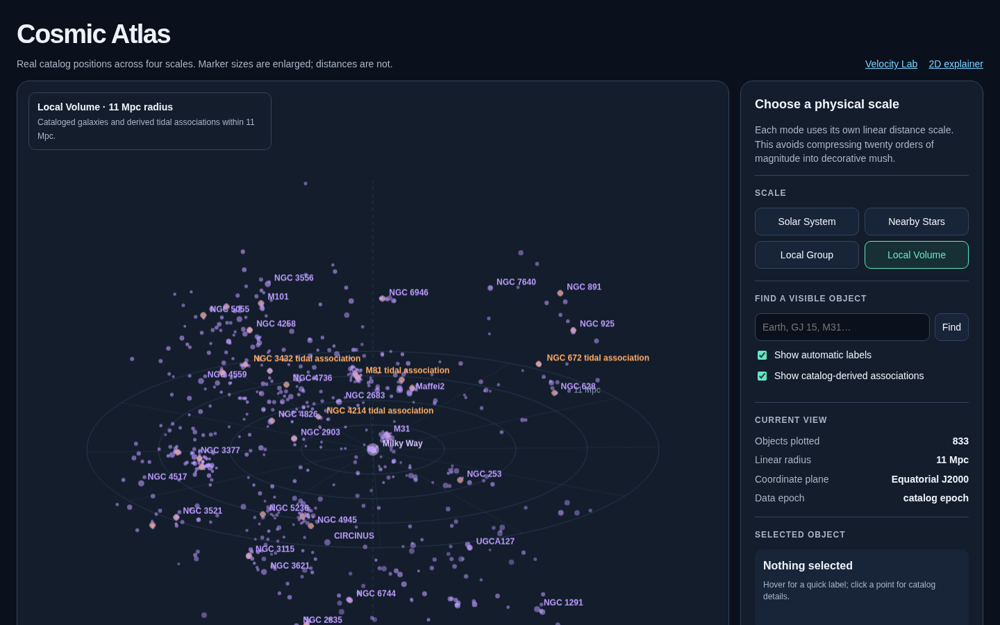

# How We Move Through the Cosmos

A standalone, responsive SVG visualization of several motions that are often collapsed into the vague phrase “moving through space.”

The diagram separates four reference frames:

- Earth around the Sun
- the Sun around the center of the Milky Way
- the Milky Way and Andromeda within the Local Group
- the Local Group relative to the cosmic microwave background (CMB)

It also shows why the Local Group’s roughly **627 km/s** CMB velocity and the Sun’s roughly **308 km/s** motion relative to the Local Group produce a Solar System CMB velocity of only about **370 km/s**: the vectors partially oppose one another.


## View it

Open [`index.html`](index.html) in a browser for the interactive 3D + time velocity model. Drag to rotate, scroll to zoom, toggle individual vectors, or play one year of Earth’s orbital velocity.

Open [`atlas.html`](atlas.html) for the position-space Cosmic Atlas. It presents four separate linear scales—Solar System, Nearby Stars, Local Group, and Local Volume—with real catalog coordinates, object search, hover labels, and catalog details.



The original responsive SVG overview remains available as [`explainer.html`](explainer.html). Both pages contain no external assets, web fonts, or tracking.

## Scientific notes

- Values are rounded for an educational overview.
- Arrow lengths and geometry are illustrative, not a shared spatial scale.
- Directions are three-dimensional and expressed in Galactic coordinates where appropriate.
- Earth’s orbital velocity changes the observed CMB dipole slightly throughout the year.
- “The Milky Way is moving at…” is incomplete unless a reference frame is named.

## Sources

- [NASA LAMBDA: CMB Solar Dipole Amplitude and Direction](https://lambda.gsfc.nasa.gov/education/lambda_graphics/cmb_dipole.html)
- [ESA Gaia: Galactic acceleration and the Sun’s motion](https://www.cosmos.esa.int/web/gaia/edr3-startrails)
- [NASA: Basics of Space Flight — The Solar System](https://science.nasa.gov/learn/basics-of-space-flight/chapter1-1/)
- [NASA/IPAC: Density and Peculiar Velocity Fields of Nearby Galaxies](https://ned.ipac.caltech.edu/level5/March01/Strauss/Strauss7.html)
- [van der Marel et al. (2012): The M31 Velocity Vector II](https://arxiv.org/abs/1205.6864)
- [NASA/JPL Horizons system](https://ssd.jpl.nasa.gov/horizons/)
- [Fifth Catalogue of Nearby Stars (CNS5)](https://cdsarc.cds.unistra.fr/viz-bin/cat/J/A%2BA/670/A19)
- [Updated Nearby Galaxy Catalog](https://heasarc.gsfc.nasa.gov/W3Browse/all/neargalcat.html)

## Rebuilding the atlas data

The checked-in catalog snapshot keeps the public site fast and reproducible. Refresh it with:

```bash
node scripts/build-atlas-data.mjs
```

The builder queries planet vectors sequentially to respect NASA/JPL Horizons service limits. Association markers are derived from positive tidal-index membership around each cataloged main disturber; they are not presented as measured physical boundaries.

## Publishing

This folder can be served directly with GitHub Pages.

## License

Licensed under [Creative Commons Attribution 4.0 International](LICENSE.md). You may share and adapt it, including commercially, with appropriate credit.

The CC BY 4.0 license covers this project’s visualization and original code. Catalog records retain the attribution and reuse terms of their respective NASA/ESA/CDS sources.
